# The Engineer's Guide to Apache Kafka

> A ground-up guide to understanding Kafka: what it is, the problems it solves, its core concepts, and how it helps you design fault-tolerant, scalable, event-driven systems.

## Definition in one paragraph

**Apache Kafka** is an open-source, distributed **event streaming platform**. At its core it is a cluster of servers (brokers) that store streams of records in **durable, ordered, append-only logs** called topics, split into partitions and replicated across brokers. Applications called **producers** write records to topics; applications called **consumers** read them back, from any position, at their own pace, without removing them. Because records are kept rather than deleted on read, the same stream can feed many independent consumers and can be replayed later. Kafka was created at LinkedIn in 2011 and is now an Apache Software Foundation project used as the messaging backbone, event store, and data pipeline layer in many large systems.

In one line: **Kafka is a distributed, replicated, replayable commit log that systems publish to and subscribe from.**

---

## Table of Contents

1. [Why Kafka Exists — The Problem](#1-why-kafka-exists--the-problem)
2. [What Kafka Actually Is](#2-what-kafka-actually-is)
   - [2.1 Kafka vs RabbitMQ](#21-kafka-vs-rabbitmq)
3. [The Log: Kafka's Foundational Idea](#3-the-log-kafkas-foundational-idea)
4. [Core Concepts (in the right order)](#4-core-concepts-in-the-right-order)
   - [4.1 Messages / Records](#41-messages--records)
   - [4.2 Topics](#42-topics)
   - [4.3 Partitions](#43-partitions)
   - [4.4 Offsets](#44-offsets)
   - [4.5 Producers](#45-producers)
   - [4.6 Consumers & Consumer Groups](#46-consumers--consumer-groups)
   - [4.7 Brokers & the Cluster](#47-brokers--the-cluster)
   - [4.8 Replication (Leaders & Followers)](#48-replication-leaders--followers)
   - [4.9 ZooKeeper vs KRaft](#49-zookeeper-vs-kraft)
5. [How a Message Flows End-to-End](#5-how-a-message-flows-end-to-end)
6. [Delivery Guarantees & Reliability](#6-delivery-guarantees--reliability)
7. [Ordering, Keys & Partitioning](#7-ordering-keys--partitioning)
8. [Consumer Group Rebalancing](#8-consumer-group-rebalancing)
9. [Data Retention, Log Compaction & Storage](#9-data-retention-log-compaction--storage)
10. [How Kafka Enables Fault-Tolerant Systems](#10-how-kafka-enables-fault-tolerant-systems)
11. [Kafka in Microservice Architectures](#11-kafka-in-microservice-architectures)
12. [Common Design Patterns](#12-common-design-patterns)
13. [The Kafka Ecosystem](#13-the-kafka-ecosystem)
14. [Operational Concerns & Pain Points](#14-operational-concerns--pain-points)
15. [When NOT to Use Kafka](#15-when-not-to-use-kafka)
16. [Glossary of Terms](#16-glossary-of-terms)
17. [Mental Model Cheat Sheet](#17-mental-model-cheat-sheet)

---

## 1. Why Kafka Exists — The Problem

Before Kafka, connecting many systems together created a tangled mess. Imagine you have several source systems (a website, a payment service, a database) and several target systems (analytics, a data warehouse, a search index, email alerts).

### The "spaghetti integration" problem

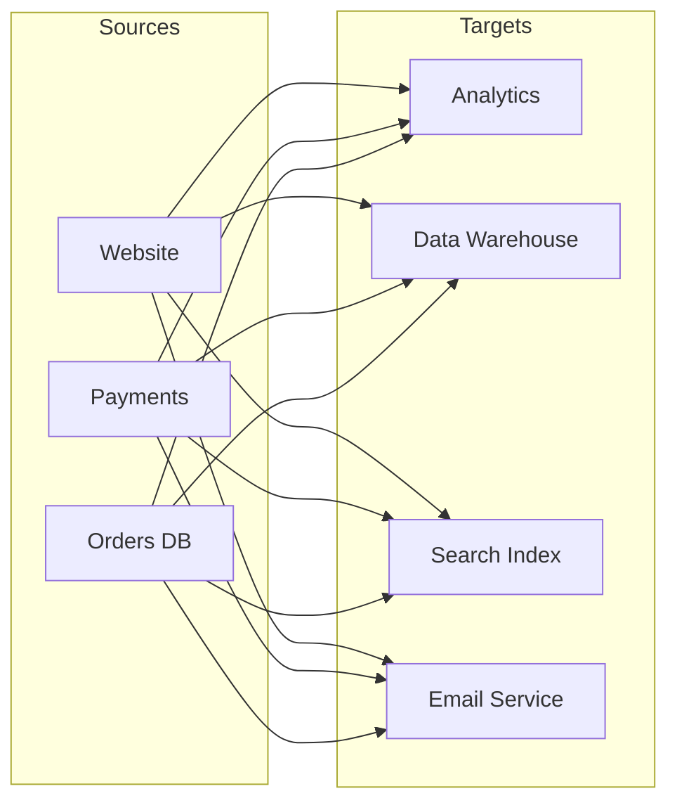

With **M** sources and **N** targets, you end up building and maintaining **M × N** point-to-point integrations. Each has its own protocol (HTTP, JDBC, TCP), data format (JSON, Avro, binary), and failure behavior. Adding one new system means wiring it to everything else.

**The pain points this creates:**

| Pain Point | Description |
|---|---|
| **Tight coupling** | Every producer must know about every consumer. A change in one ripples everywhere. |
| **Scaling walls** | Synchronous calls mean a slow consumer slows down the producer. |
| **Data loss** | If a target is down, messages sent to it are lost unless you build custom buffering. |
| **No replay** | Once a message is delivered and processed, it's gone. Can't reprocess history. |
| **Backpressure** | A fast producer can overwhelm a slow consumer. |
| **Operational overhead** | M×N connections, each monitored and maintained separately. |

### The Kafka solution: decouple with a central log

Kafka inserts a **durable, distributed commit log** in the middle. Producers write to Kafka; consumers read from Kafka. Neither knows about the other.

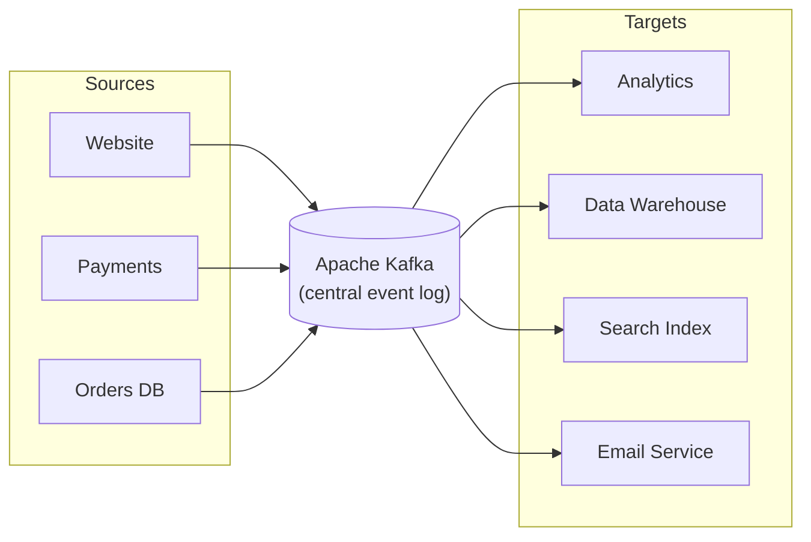

Now it's **M + N** connections. Systems are decoupled in **space** (they don't know each other), in **time** (consumer can be offline and catch up later), and in **throughput** (each reads at its own pace).

---

## 2. What Kafka Actually Is

Apache Kafka is a **distributed event streaming platform**. Break that down:

- **Distributed** — it runs as a cluster across multiple machines (brokers) for scalability and fault tolerance.
- **Event streaming** — it deals with continuous streams of *events* (something that happened: "user clicked", "payment processed", "temperature reading = 22°C").
- **Platform** — it's not just a message queue; it provides storage, processing, and connectors.

Three core capabilities:

1. **Publish & subscribe** to streams of events (like a messaging system).
2. **Store** streams of events durably and reliably for as long as you want.
3. **Process** streams of events as they occur or retrospectively.

> **Key mental shift:** Kafka is often called a "message queue," but it's more accurate to think of it as a **distributed, append-only, replayable log**. Messages aren't deleted when read — they persist, and many consumers can read the same data independently.

### 2.1 Kafka vs RabbitMQ

The comparison people reach for most often is **RabbitMQ**, a traditional message broker. Both move messages between systems, but they are built on different models, and that difference drives almost every practical distinction.

**The core difference: smart broker vs dumb broker**

```
RabbitMQ  (smart broker, dumb consumer)

  Producer ──► Exchange ──routing rules──► Queue ──push──► Consumer
                                            │
                                            └── message deleted after ack

Kafka  (dumb broker, smart consumer)

  Producer ──► Topic / Partition log ◄──pull (offset)── Consumer
                        │
                        └── message retained; consumer tracks its own position
```

- **RabbitMQ** does the thinking. Exchanges route each message to queues based on bindings, the broker pushes messages to consumers, tracks per-message acknowledgement, and deletes a message once it is acked. The queue is a transient buffer.
- **Kafka** does very little per message. It appends to a log and serves fetch requests. The consumer decides where to read from and records its own offset. The topic is durable storage.

**Side by side**

| Aspect | Kafka | RabbitMQ |
|---|---|---|
| **Model** | Distributed append-only log, pub/sub over partitions | Message broker with exchanges, bindings, and queues (AMQP) |
| **After a message is read** | Stays in the log until retention expires; can be re-read | Removed from the queue once acknowledged |
| **Replay / history** | Built in: reset the offset, re-read from any point | Not supported; once consumed it is gone (streams plugin adds a log-style option) |
| **Delivery** | Consumer **pulls** batches | Broker **pushes** to consumers, with prefetch limits |
| **Ordering** | Strict per partition; use keys to group related events | Per queue with a single consumer; breaks with multiple competing consumers or requeues |
| **Routing** | Minimal: producer picks topic and partition | Rich: direct, topic, fanout, headers exchanges; routing keys and wildcards |
| **Per-message features** | None: no priorities, no per-message TTL, no individual ack/nack | Priorities, per-message TTL, individual ack/nack/requeue, dead-lettering per queue |
| **Multiple independent readers** | Natural: each consumer group gets the full stream | Needs one queue bound per subscriber; fanout exchange copies the message into each |
| **Throughput** | Very high: sequential disk I/O, batching, zero-copy; millions of msg/s per cluster | High for a broker, but lower; per-message bookkeeping is the cost |
| **Latency** | Low milliseconds; batching adds a small floor | Low, often sub-millisecond for small loads |
| **Scaling consumers** | Add consumers up to the partition count | Add consumers to a queue freely; they compete |
| **Scaling the broker** | Horizontal: partitions spread across brokers | Clustering and quorum queues; large fan-out is harder to scale |
| **Durability** | Replicated log, `acks=all`, `min.insync.replicas` | Durable queues plus persistent messages; quorum queues replicate via Raft |
| **Message size** | Optimized for many small messages; large blobs go elsewhere | Handles larger messages more comfortably |
| **Stream processing** | Kafka Streams, ksqlDB, Flink connectors, Connect | Not a focus; you process in consumers |
| **Protocol** | Kafka's own binary protocol | AMQP 0-9-1, plus MQTT and STOMP plugins |
| **Operational feel** | Heavier: cluster, partitions, retention, lag monitoring | Lighter to start; management UI is excellent |

**When to pick which**

- **Choose Kafka** when you need an **event stream**: high volume, durable history, many independent consumers reading the same data, replay for reprocessing or new services, event sourcing, CDC, or stream processing. Kafka is the backbone of an event-driven architecture.
- **Choose RabbitMQ** when you need a **task queue or message router**: work distribution to workers, request/reply over messaging, complex routing by content, priorities, per-message expiry, or delayed delivery. RabbitMQ is excellent at "deliver this specific job to one worker and forget it."
- **Both together** is common: Kafka as the event backbone between services, RabbitMQ for internal job queues inside a service.

**A mental shortcut**

> RabbitMQ answers *"who should handle this message, and did they?"*
> Kafka answers *"what happened, in what order, and let anyone read it whenever they want."*

If you find yourself wanting to re-read old messages, feed the same data to several teams, or scale past one broker's throughput, you want Kafka. If you find yourself wanting per-message priorities, routing rules, or simple competing workers at modest volume, RabbitMQ will be simpler to run and reason about. [Section 15](#15-when-not-to-use-kafka) expands on the cases where Kafka is the wrong tool.

---

## 3. The Log: Kafka's Foundational Idea

Everything in Kafka is built on the concept of a **log** — an ordered, append-only sequence of records. This is the single most important concept to internalize.

```
        append here ──►
  ┌────┬────┬────┬────┬────┬────┬────┐
  │ 0  │ 1  │ 2  │ 3  │ 4  │ 5  │ 6  │   ← each cell is a record
  └────┴────┴────┴────┴────┴────┴────┘
    ▲                        ▲
  oldest                  newest
```

Properties of the log:

- **Append-only:** new records go to the end. You never insert in the middle or update.
- **Ordered:** records have a strict order, identified by their position number (the **offset**).
- **Immutable:** once written, a record doesn't change.
- **Replayable:** a reader can start from any offset and read forward. Reading doesn't consume or remove data.

This simple structure is why Kafka is so powerful: it's essentially a database's write-ahead log, exposed as a first-class abstraction that many systems can share.

---

## 4. Core Concepts (in the right order)

The concepts below build on each other. Read them in order.

### 4.1 Messages / Records

The unit of data in Kafka. A record contains:

```
┌─────────────────────────────────────────┐
│  Record                                   │
│  ┌─────────┬──────────┬────────┬───────┐ │
│  │  Key    │  Value   │ Headers│  Time │ │
│  │(optional)│ (payload)│(meta)  │ stamp │ │
│  └─────────┴──────────┴────────┴───────┘ │
└─────────────────────────────────────────┘
```

- **Key** *(optional)* — used to decide which partition the record goes to, and for compaction. E.g. a `customerId`.
- **Value** — the actual payload (JSON, Avro, Protobuf, plain bytes).
- **Headers** *(optional)* — key/value metadata (e.g. tracing IDs, schema version).
- **Timestamp** — when the event occurred or was appended.

To Kafka, keys and values are just **byte arrays**. Serialization (turning objects into bytes) and deserialization ("serde") happen in the client.

### 4.2 Topics

A **topic** is a named category or feed to which records are published. Think of it as a table name in a database, or a folder in a filesystem — a logical grouping of related events.

Examples: `user-signups`, `payment-transactions`, `sensor-readings`.

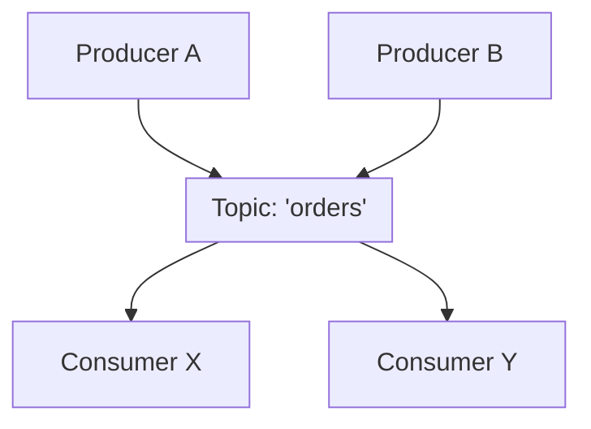

- Producers write to topics; consumers read from topics.
- A topic can have **many producers and many consumers**.
- Topics are **multi-subscriber** — the same data can be read by many independent consumers.

### 4.3 Partitions

Here's where scalability comes in. A topic is split into one or more **partitions**. Each partition is an independent, ordered log.

```
Topic: "orders"  (3 partitions)

Partition 0:  ┌──┬──┬──┬──┬──┐
              │0 │1 │2 │3 │4 │ ──►
              └──┴──┴──┴──┴──┘
Partition 1:  ┌──┬──┬──┬──┐
              │0 │1 │2 │3 │ ──►
              └──┴──┴──┴──┘
Partition 2:  ┌──┬──┬──┬──┬──┬──┐
              │0 │1 │2 │3 │4 │5 │ ──►
              └──┴──┴──┴──┴──┴──┘
```

**Why partitions matter:**

- **Parallelism / scalability:** partitions can live on different brokers, so a single topic's reads and writes scale across the whole cluster. More partitions = more parallel throughput.
- **Ordering guarantee is per-partition, not per-topic.** Records within one partition are strictly ordered. Across partitions, there is *no* global order.
- **Unit of parallelism for consumers:** within a consumer group, each partition is consumed by exactly one consumer (more on this below).

> ⚠️ **Trade-off:** more partitions give more parallelism but add overhead (open file handles, memory, longer leader-election/rebalance times, and more end-to-end latency). Choosing partition count is a key design decision.

### 4.4 Offsets

Each record within a partition has a unique, monotonically increasing ID called the **offset** — its position in that partition's log.

```
Partition 0:  ┌────┬────┬────┬────┬────┬────┐
     offset:  │ 0  │ 1  │ 2  │ 3  │ 4  │ 5  │
              └────┴────┴────┴────┴────┴────┘
                                   ▲
                       consumer's next read position
                       "processed 0-3, committed offset = 4"
```

Note the convention: the committed offset is the **next offset to read**, not the last one processed. After finishing records 0 to 3 the consumer commits 4.

- Offsets are **per-partition**. Offset 5 in partition 0 is unrelated to offset 5 in partition 1.
- A consumer tracks *"which offset have I processed up to?"* by **committing** offsets. This is how it resumes after a restart.
- Because Kafka stores data durably, a consumer can **rewind** (reprocess old data) or **skip ahead**.

This is the mechanism behind Kafka's superpower: **replay**. Reset your offset to 0 and reprocess the entire history.

#### Where committed offsets live

The broker does keep a "map" of how far each reader has got, but it is keyed by **consumer group + topic + partition**, not by individual consumer. It is stored in Kafka itself, in an internal compacted topic called `__consumer_offsets`:

```
key:    (group.id, topic, partition)
value:  (offset, metadata, commit timestamp)
```

- Because the topic is **compacted**, only the latest offset per key survives.
- Because it is a normal **replicated** topic, the bookmarks survive broker failures like any other data.
- Each group is assigned a **group coordinator** (one broker, chosen by hashing the `group.id`). Commits, heartbeats, and rebalances for that group go to the coordinator, not to the partition leader.
- The key is the *group*, not the consumer, so when a partition moves to another member during a rebalance the new owner picks up the same bookmark.

What the broker does **not** do with the offset:

- It does not track a consumer's live read position, only what the consumer has explicitly committed. A consumer can be thousands of records ahead of its committed offset.
- It does not enforce anything. A consumer can `seek()` anywhere. The commit is a bookmark the consumer saves for itself, not a lock.
- Consumers with no `group.id` that use manual `assign()` commit nothing here. They manage offsets themselves.

Consumer lag falls out of this directly: latest offset in the partition minus the value stored in `__consumer_offsets`.

### 4.5 Producers

A **producer** is a client application that publishes (writes) records to topics.

Key producer behaviors:

- **Partition selection:** The producer decides which partition a record goes to:
  - If a **key** is provided → `hash(key) % numPartitions` (same key always → same partition → ordering per key).
  - If **no key** → records are distributed (round-robin / sticky) across partitions for load balancing.
- **Batching:** producers group records into batches for efficiency (higher throughput, better compression).
- **Compression:** batches can be compressed (gzip, snappy, lz4, zstd) to save network and disk.
- **Acknowledgements (`acks`):** controls durability guarantee (see [Section 6](#6-delivery-guarantees--reliability)).

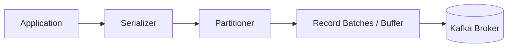

#### How batching works and the `linger.ms` window

The producer does not send records one at a time. After serializing a record and picking its partition, it places the record into an in-memory buffer grouped **per destination partition**. That group is a **batch**. The whole batch is compressed and sent to the partition leader in one request.

There is a short window during which the producer collects records into a batch. You control that window with `linger.ms`. When the first record lands in an empty batch, a timer starts. The batch is sent when **either** of these happens first:

- the `linger.ms` timer expires, or
- the batch reaches `batch.size` bytes.

So `linger.ms` is the **maximum** time a record waits in the buffer, an upper bound rather than a fixed delay.

```
batch.size         max bytes per partition batch before it is sent
linger.ms          how long to wait for more records before sending a partial batch
compression.type   none | gzip | snappy | lz4 | zstd
buffer.memory      total memory the producer may use for unsent batches
```

Typical values:

```
linger.ms=0     (default)  send as soon as a sender thread is free.
                           Batching still happens under load, because records pile up
                           while the previous request is in flight.

linger.ms=5     wait up to 5 ms to collect more records per partition.
                Common production sweet spot: bigger batches, tiny latency cost.

linger.ms=100   throughput-oriented (log shipping, CDC). Each record may wait up to 100 ms.
```

Why batch and compress at all:

- Fewer network round trips and fewer disk appends on the broker.
- Compression works far better on a batch than on a single tiny record, because there is more repeated structure to squeeze.
- The batch stays compressed on the broker's disk and is decompressed by the consumer, so the broker does very little CPU work.

The trade-off is the reason Kafka is high-throughput but not a microsecond-latency system. Higher `linger.ms` means larger, more efficient batches, and each record waits a little longer before leaving the producer. Even at `linger.ms=0` you rarely get one-record batches under real traffic, because the sender can only have a limited number of requests in flight per broker, and records arriving in the meantime accumulate into the next batch. `linger.ms` matters most at low or bursty traffic where the buffer would otherwise be sent nearly empty.

This window is entirely on the producer side. Brokers and consumers know nothing about it. The consumer side has a mirror setting, `fetch.max.wait.ms`, which controls how long the broker waits to fill a fetch response before replying.

### 4.6 Consumers & Consumer Groups

A **consumer** reads records from topics. Consumers are almost always organized into **consumer groups**.

A **consumer group** is a set of consumers that cooperate to consume a topic. Kafka guarantees:

> **Each partition is assigned to exactly one consumer within a group.**

This is how Kafka scales consumption horizontally while preserving order.

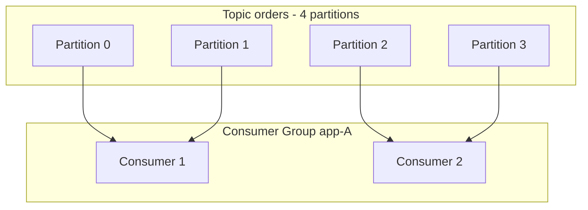

Key rules:

- **Scaling out:** add consumers to a group to share the load — up to the number of partitions. If you have 4 partitions, a 5th consumer sits idle.
- **Fault tolerance:** if a consumer dies, its partitions are **rebalanced** onto the survivors.
- **Independent groups:** *different* consumer groups each get their *own full copy* of the stream. Group A and Group B both read every message independently, each tracking its own offsets.

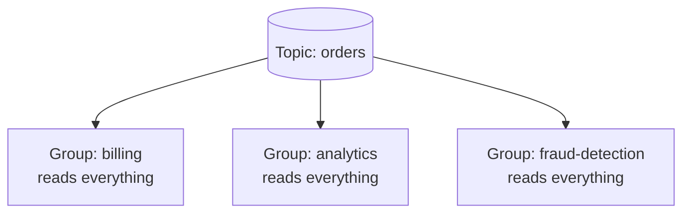

This dual behavior lets Kafka act as **both** a queue (competing consumers within a group) **and** a publish/subscribe system (multiple groups) at the same time.

To be precise about the rule: a partition is consumed by **exactly one consumer within a group**, but that same partition can be consumed by **many consumers at once as long as they are in different groups**. All of them read the same bytes from the same leader replica. The broker does not copy the data per group; it just serves fetch requests from the log at whatever offset each group asks for.

```
Topic orders, partition 0

  group billing     ->  consumer B1  committed offset 8,400
  group analytics   ->  consumer A3  committed offset 8,900
  group fraud       ->  consumer F1  committed offset 2,100  (lagging; nobody else cares)
```

#### What should be in one consumer group?

**One consumer group = the replicas of one application.** Every instance of a service uses the same `group.id`, typically the service name fixed in its config. Instances are told apart by `client.id` (for metrics) and optionally `group.instance.id` (for static membership).

```
topic: orders

group "billing-service"    ->  billing pod 1, billing pod 2, billing pod 3
group "search-indexer"     ->  indexer pod 1, indexer pod 2
group "analytics"          ->  analytics pod 1
```

Do **not** put different applications in the same group. A group has one shared set of committed offsets per partition, and each partition goes to exactly one member. If a billing consumer and a search-indexer consumer shared a group, billing would receive partitions 0 and 1 and the indexer partitions 2 and 3. Half the orders would never be billed and half would never be indexed. Each application would see a random slice of the stream instead of the whole thing.

Consequences of this rule:

- Each application scales independently against the same partitions. Scaling one service up or down triggers a rebalance only inside its own group.
- A group's maximum useful replica count equals the topic's partition count. Two groups of five on a four-partition topic is fine; each group independently has one idle member.
- Consumers with no `group.id` that use manual `assign()` sit outside this rule. You can point ten of them at the same partition and Kafka will not stop you, but none of them commit to a group.

The rare legitimate exception is two builds of the *same* service sharing a group, for example blue and green deployments during a rolling upgrade. From Kafka's point of view they are still one application.

### 4.7 Brokers & the Cluster

A **broker** is a single Kafka server. A **cluster** is a group of brokers working together.

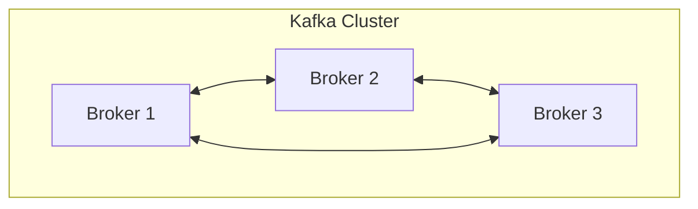

- Each broker holds some of the partitions (and their replicas). Partitions are **spread across brokers** to balance load and storage.
- One broker acts as the **controller** (coordinates administrative work like leader elections and partition assignment).
- Clients (producers/consumers) can connect to any broker; Kafka tells them which broker leads each partition. This is the **bootstrap** process.

Example of partition distribution across brokers for a topic with 3 partitions and replication factor 2:

```
              Broker 1        Broker 2        Broker 3
            ┌──────────┐    ┌──────────┐    ┌──────────┐
Part 0      │ LEADER   │    │ follower │    │          │
Part 1      │          │    │ LEADER   │    │ follower │
Part 2      │ follower │    │          │    │ LEADER   │
            └──────────┘    └──────────┘    └──────────┘
```

### 4.8 Replication (Leaders & Followers)

Replication is what makes Kafka **fault tolerant**. Each partition is replicated across multiple brokers according to the **replication factor** (e.g. RF=3 means 3 copies).

For each partition:

- One replica is the **leader**. All reads and writes go through the leader.
- The other replicas are **followers**. They passively copy the leader's data.
- If the leader's broker fails, one of the followers is promoted to leader automatically.

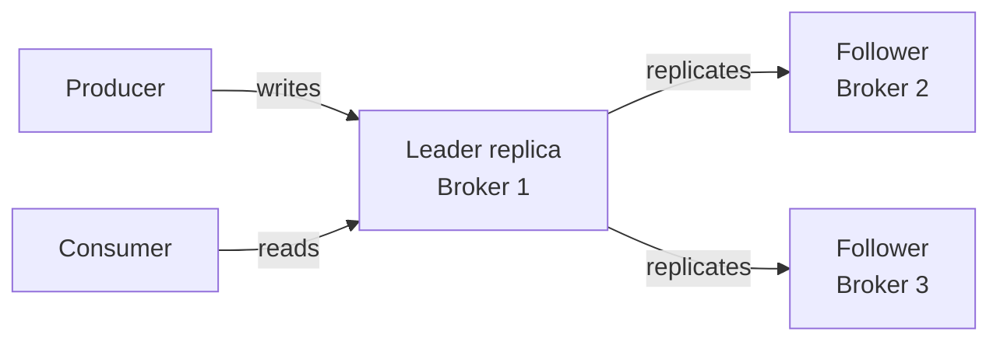

**In-Sync Replicas (ISR):** the set of replicas that are fully caught up with the leader. Only ISR members are eligible to become leader. This is central to durability:

- `min.insync.replicas` defines how many replicas must acknowledge a write (together with producer `acks=all`) before it's considered committed.
- Example: RF=3, `min.insync.replicas=2`, `acks=all` → a write succeeds only when the leader + at least 1 follower have it. You can lose 1 broker with **zero data loss**.

```
Replication Factor = 3, min.insync.replicas = 2

     ┌─────────── ISR (in sync) ───────────┐
     │  Leader ✓   Follower1 ✓   Follower2 ✓ │
     └──────────────────────────────────────┘
                 write needs 2 acks ──► committed
```

#### What `min.insync.replicas` does and does not gate

This setting is **not** a prerequisite for every action in Kafka. It gates exactly one thing: **accepting a write when the producer asks for `acks=all`**.

Before the leader acknowledges an `acks=all` write, it checks how many replicas are currently in the ISR. If that count is below `min.insync.replicas`, the leader rejects the write with `NotEnoughReplicasException`. The producer retries and eventually fails.

It does **not** affect:

- Writes with `acks=0` or `acks=1`. The setting is ignored for those producers entirely.
- Reads. Consumers can still fetch everything already committed on the partition.
- Topic creation, offset commits, rebalances, admin work.

Why it exists: `acks=all` on its own means "wait for all replicas *currently in the ISR*." If two of three brokers die, the ISR shrinks to just the leader and `acks=all` silently degrades to `acks=1`. `min.insync.replicas` is the floor that stops that degradation: "if fewer than N copies can confirm, refuse the write rather than pretend it is durable."

The scope is **per partition**, because the ISR is tracked per partition. If partition 2's replicas sit on two dead brokers while partition 0's are healthy, partition 0 keeps accepting writes and only partition 2 becomes read-only for strict producers. With keyed records this shows up as "some orders fail, most succeed" rather than a total outage, because a specific set of keys maps to the blocked partition.

The usual recipe:

```
replication.factor      = 3
min.insync.replicas     = 2
producer acks           = all
```

This tolerates one broker down with zero data loss and keeps accepting writes. Lose two brokers and the affected partitions go read-only for `acks=all` producers until a replica catches up. That is the trade-off: write availability versus a durability guarantee you can trust. It is a broker default and a per-topic override, so you can be strict on a payments topic and relaxed on a metrics topic in the same cluster.

### 4.9 ZooKeeper vs KRaft

Kafka needs to store cluster metadata (which brokers exist, who leads each partition, configs, ACLs).

- **Historically:** an external **ZooKeeper** ensemble managed this. Extra system to run and tune.
- **Modern Kafka (KRaft mode):** Kafka manages its own metadata using an internal Raft consensus protocol — **no ZooKeeper needed**. Simpler to operate, faster failovers, scales to more partitions.

> As of recent Kafka versions, **KRaft is the default and ZooKeeper is deprecated/removed**. New deployments should use KRaft. If you see ZooKeeper referenced, it's legacy.

---

## 5. How a Message Flows End-to-End

Putting the concepts together, here's the full lifecycle of a message:

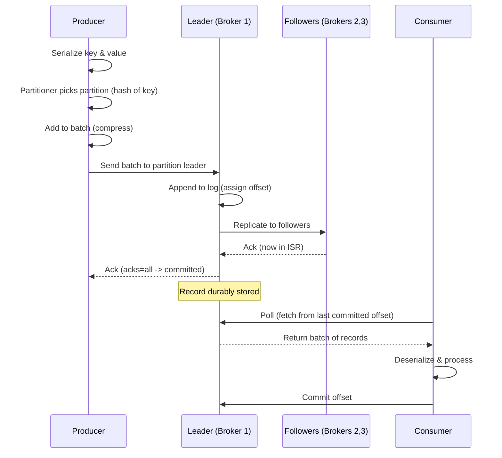

Step by step:

1. **Produce:** the producer serializes the record, the partitioner selects a partition, records are batched and sent to that partition's **leader**.
2. **Append:** the leader appends the record to its log and assigns it the next **offset**.
3. **Replicate:** followers copy the record; once enough ISRs have it, the write is **committed**.
4. **Acknowledge:** the leader acks the producer (based on the `acks` setting).
5. **Consume:** consumers **poll** the leader, fetch batches starting from their last committed offset, deserialize, and process.
6. **Commit offset:** the consumer records how far it has processed, so it can resume after a restart.

Two simplifications in the diagram worth knowing:

- `P->>P: Add to batch (compress)` is where the `linger.ms` window from [Section 4.5](#45-producers) happens. The self-arrow means the producer is working alone; only the next line is a network send.
- `C->>L: Commit offset` actually goes to the group's **coordinator** broker and is written to `__consumer_offsets` (see [Section 4.4](#44-offsets)), not to the partition leader.

---

## 6. Delivery Guarantees & Reliability

Kafka supports three delivery semantics. Understanding them is critical for correctness.

| Guarantee | Meaning | How | Risk |
|---|---|---|---|
| **At-most-once** | Each message delivered 0 or 1 times | Commit offset *before* processing; no retries | Messages can be **lost** |
| **At-least-once** | Each message delivered 1+ times | Commit offset *after* processing; retries on failure | **Duplicates** possible |
| **Exactly-once** | Each message effect applied exactly once | Idempotent producer + transactions | Most complex, some overhead |

### Who commits, and when

"Commit before" and "commit after" both refer to the **same consumer**. The difference is the order of two steps inside its own poll loop.

```
At-most-once                         At-least-once (the usual choice)

records = poll()                     records = poll()
commitOffset()   <- 1. save first    process(records)  <- 1. do the work
process(records) <- 2. then work     commitOffset()    <- 2. then save
```

- **At-most-once:** crash between 1 and 2 and the offset is already saved. On restart the consumer resumes *after* those records. They were never processed and never will be.
- **At-least-once:** crash between 1 and 2 and the offset was not saved. On restart the consumer re-reads and re-processes those records. This is why consumers must be **idempotent**.

How you control it in code: the default consumer has `enable.auto.commit=true`, which commits on a timer during `poll()`. In practice that gives at-least-once, because the commit happens at the start of the *next* poll, after the previous batch was handed to your code. But if your processing is asynchronous and still running when the next poll fires, it silently becomes at-most-once. For explicit control:

```
enable.auto.commit=false
consumer.commitSync()   // call after processing, for at-least-once
```

At-most-once is the cheapest option and fits metrics, telemetry, or sampled click data where a lost record is fine and a duplicate would skew a count. For business events such as payments or orders you almost never want it.

### What "applied exactly once" means

The word **applied** is deliberate. It moves the promise from *delivery* to *outcome*.

Exactly-once *delivery* is impossible in a distributed system: acks get lost and processes crash mid-step, so the same record will sometimes be transmitted or read twice. What Kafka can guarantee is that the **effect** of processing that record shows up in the result exactly once. The record may be read twice, but the output topic ends up with one result record and the offset advances once. Aborted work is never visible to `read_committed` consumers.

Example: a processor sums payments per customer and writes running totals to an output topic.

```
input:    payment 50 for customer 42
crash:    after writing total=150 to output, before committing offset
restart:  re-reads payment 50
```

Without transactions the output topic shows total=150 and then total=200. The payment was applied twice. With transactions the first total=150 was inside an uncommitted transaction, is aborted on restart, hidden from readers, and the retry writes total=150 once.

This wording also tells you where the guarantee **stops**. The effect Kafka controls is writes to Kafka topics and offset commits. If the processing step also sends an email or updates a SQL row, that effect is outside the transaction and can still happen twice. Read the table as:

- at-most-once: the message may never be processed
- at-least-once: the message may be processed more than once
- exactly-once: the message's Kafka-visible result appears once, provided the whole pipeline is Kafka in, Kafka out

### Producer durability: the `acks` setting

```
acks=0    "fire and forget"
          Producer doesn't wait. Fastest, but data can vanish.
          Producer ──► [Leader]        (no wait)

acks=1    "leader acknowledged"
          Waits for leader only. Data lost if leader dies before
          followers replicate.
          Producer ──► [Leader] ──ack──► Producer

acks=all  "fully replicated" (safest)
          Waits for all in-sync replicas. Combined with
          min.insync.replicas, gives strong durability.
          Producer ──► [Leader]+[ISR followers] ──ack──► Producer
```

### Idempotent producer

With `enable.idempotence=true`, the producer attaches a sequence number to each record so the broker can **deduplicate retries**. This prevents duplicates caused by network retries within a partition. It's the default in modern Kafka and a prerequisite for exactly-once.

The hole it closes:

```
producer sends batch  ->  broker writes it  ->  ack is lost on the network
producer times out    ->  retries the same batch  ->  broker writes it AGAIN
```

Without idempotence the partition now holds the record twice and every consumer sees both. With it, the producer obtains a **producer ID** from the broker and stamps every batch with a **sequence number per partition**. The broker remembers the last sequence it accepted for that producer on that partition. A retried batch arrives with a sequence it has already seen, so the broker drops it and still returns a success ack. Retries become safe.

Scope: one producer, one partition, one session. It does nothing about a crashed producer restarting with a new ID, and nothing about the consumer side.

#### How the sequence number is created

The sequence number is not generated by any clever algorithm. The producer simply **counts**, and the broker **checks the count**.

Think of mailing numbered letters to a friend. You send letter 1, 2, 3. If letter 2 is lost, your friend notices the gap between 1 and 3. If you accidentally send letter 2 twice, your friend sees the number, says "I already have this one," and throws the copy away. The sequence number is that number on the envelope.

**Who writes the number: the producer.** It keeps a small in-memory table, one row per partition it writes to:

```
partition 0:  next number to use = 0
partition 1:  next number to use = 0
partition 2:  next number to use = 0
```

Every time it sends a batch to partition 0, it stamps the batch with the current number and then adds one for each record in the batch. Only the base number is written in the batch header; each record's own sequence is implied by its position.

```
partition 0:  batch A  base seq 0   (3 records)  -> counter becomes 3
              batch B  base seq 3   (5 records)  -> counter becomes 8
partition 1:  batch C  base seq 0   (2 records)  -> counter becomes 2
```

Partition 1 has its own separate count. Each partition leader is a different broker, and batches to different partitions travel in parallel, so a per-partition counter lets each leader see an unbroken sequence without coordinating with anyone.

**What the broker does: remembers the last number it accepted.** The leader of partition 0 holds "last sequence from this producer = 7" and keeps the metadata of the last five batches. A batch arrives:

| Batch says | Broker's reaction |
|---|---|
| 8 | Next expected number. Append it, reply OK. |
| 7 again | Already have it. This is a retry whose earlier OK was lost. **Do not append**, but still reply OK with the original offset so the producer stops retrying. |
| 10 | Numbers 8 and 9 never arrived. Reply `OutOfOrderSequenceException`. The producer does not silently skip. |

The "last five batches" limit is why `max.in.flight.requests.per.connection` cannot exceed 5 with idempotence enabled. The broker only has room to recognise retries within that window.

**Why the producer ID exists.** Many producers write to the same partition and every one of them counts from 0. The broker would see lots of "0"s and could not tell them apart. So on startup the producer sends an `InitProducerId` request and receives a unique 64-bit **producer ID (PID)**. The broker keeps one "last seen" entry per PID per partition:

```
producer 501, partition 0:  last seen 7
producer 502, partition 0:  last seen 340
```

**Why it stops at restart.** The counter lives in the producer's memory. Kill the process and it is gone. The new process asks for a new PID and counts from 0 again. The broker has never seen that PID, so it accepts whatever arrives. If the old process sent a batch and died before hearing the OK, the new one has no way to know, and the record can be written twice. Only transactions with a stable `transactional.id` extend the guarantee across restarts, and they do it by **fencing** the old producer epoch rather than by continuing the old count.

### Exactly-once semantics (EOS)

Achieved by combining two mechanisms that close two **different** duplication holes:

1. **Idempotent producer** (no duplicate writes on retry) closes the hole on the write path, described above.
2. **Transactions** close the **consume → process → produce** gap. A producer can write to multiple partitions/topics *and* commit consumer offsets **atomically** (all-or-nothing).

The gap transactions close: a stream processor reads from topic A, does work, writes to topic B, and commits its offset on A. Those are two separate writes to Kafka.

```
write result to B  ->  crash before committing offset on A
restart            ->  re-read A, write result to B again      (duplicate on B)

or the reverse:
commit offset on A ->  crash before writing to B                (result lost)
```

With a transaction the producer opens a transaction, writes to B, adds the consumer offset for A into the same transaction via `sendOffsetsToTransaction()`, then commits. A **transaction coordinator** on the broker writes commit or abort markers into the logs. Either both land or neither does. Downstream consumers set `isolation.level=read_committed` so they never see records from an open or aborted transaction.

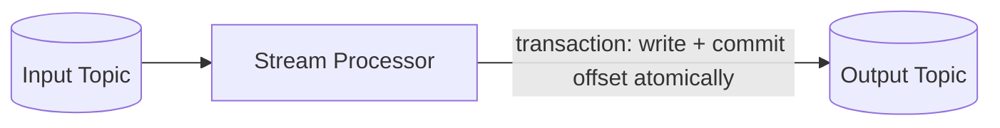

If the transaction aborts, neither the output write nor the offset commit takes effect — no partial results.

Why you need both: transactions are built **on top of** the idempotent producer. The producer ID and sequence numbers are what let the coordinator identify which writes belong to which transaction and fence off a zombie instance that was replaced after a crash. Setting `transactional.id` turns idempotence on automatically.

The honest caveat: exactly-once holds only **inside Kafka**. If the "process" step writes to a database or calls an HTTP API, that side effect is outside the transaction and can still happen twice. For those cases fall back to at-least-once plus an idempotent consumer, or use the outbox pattern from [Section 12](#12-common-design-patterns).

#### Example: a transactional consume → process → produce loop in .NET

A minimal loop using Confluent.Kafka. It reads payments, adds each one to a running total per customer, writes the total to an output topic, and commits the input offset in the **same transaction**.

```csharp
using Confluent.Kafka;

var consumer = new ConsumerBuilder<string, string>(new ConsumerConfig
{
    BootstrapServers = "localhost:9092",
    GroupId = "payment-totals",
    EnableAutoCommit = false,                     // offsets go through the transaction instead
    IsolationLevel = IsolationLevel.ReadCommitted, // never read aborted records
    AutoOffsetReset = AutoOffsetReset.Earliest,
}).Build();

var producer = new ProducerBuilder<string, string>(new ProducerConfig
{
    BootstrapServers = "localhost:9092",
    TransactionalId = "payment-totals-1",          // stable across restarts; turns on idempotence
}).Build();

producer.InitTransactions(TimeSpan.FromSeconds(10)); // registers with the transaction coordinator, fences any zombie with the same id
consumer.Subscribe("payments");

var totals = new Dictionary<string, decimal>();

while (true)
{
    var record = consumer.Consume();               // e.g. key "customer-42", value "50"

    producer.BeginTransaction();
    try
    {
        // 1. process
        var customer = record.Message.Key;
        totals[customer] = totals.GetValueOrDefault(customer) + decimal.Parse(record.Message.Value);

        // 2. write the result to the output topic (inside the transaction)
        producer.Produce("payment-totals",
            new Message<string, string> { Key = customer, Value = totals[customer].ToString() });

        // 3. commit the input offset (inside the same transaction)
        producer.SendOffsetsToTransaction(
            new[] { new TopicPartitionOffset(record.TopicPartition, record.Offset + 1) }, // next offset to read
            consumer.ConsumerGroupMetadata,
            TimeSpan.FromSeconds(10));

        // 4. both writes become visible together, or not at all
        producer.CommitTransaction();
    }
    catch (KafkaException)
    {
        producer.AbortTransaction();               // output write and offset commit are both discarded
        // rewind so the record is read again; in-memory totals would also need restoring in real code
        consumer.Seek(new TopicPartitionOffset(record.TopicPartition, record.Offset));
    }
}
```

How it maps to the concepts above:

- **The gap being closed.** Without a transaction, step 2 and step 3 are separate writes. A crash between them either duplicates the total or loses it. Here they commit as one unit.
- **The offset goes through the producer, not the consumer.** That is why `EnableAutoCommit` is off and there is no `consumer.Commit()`. The `+ 1` is the "next offset to read" convention from [Section 4.4](#44-offsets).
- **`TransactionalId` is the crash-restart fix.** A restarted instance with the same ID calls `InitTransactions`, the coordinator bumps the epoch, and the old zombie instance is fenced out. This is what plain idempotence cannot do.
- **`ReadCommitted` on the reader side.** Any consumer of `payment-totals` must also use it, or it will see records from aborted transactions.

Two simplifications to be aware of:

- One transaction per record is easy to read but slow. Real code batches many records into one transaction.
- The `totals` dictionary lives in memory, so it is outside the transaction. After an abort or a restart it may be wrong. Kafka Streams solves this by keeping state in a changelog topic that is written inside the same transaction.

---

## 7. Ordering, Keys & Partitioning

Ordering is one of the most misunderstood parts of Kafka. The rules:

- **Order is guaranteed only within a single partition.**
- **No ordering across partitions** of a topic.

Therefore: to keep related events in order, **give them the same key** so they land in the same partition.

```
Records with key = "customer-42" always go to the same partition:

  Partition 1:  [c42:login] [c42:add-to-cart] [c42:checkout]   ✓ ordered

If you used no key, they could scatter:

  Partition 0:  [c42:login] ......... [c42:checkout]
  Partition 2:  ........... [c42:add-to-cart]              ✗ order lost
```

**Design implications:**

- Choose a key that reflects your ordering/entity boundary (e.g. `accountId`, `orderId`, `deviceId`).
- Beware **hot partitions**: if one key is extremely high-volume, its partition becomes a bottleneck.
- Changing the number of partitions changes `hash(key) % n`, so **existing keys may move to different partitions** — plan partition counts up front.

---

## 8. Consumer Group Rebalancing

A **rebalance** is the process of redistributing partitions among the consumers in a group. It happens when:

- A consumer **joins** the group (scaling up).
- A consumer **leaves** or **crashes** (scaling down / failure).
- Partitions are **added** to a topic.

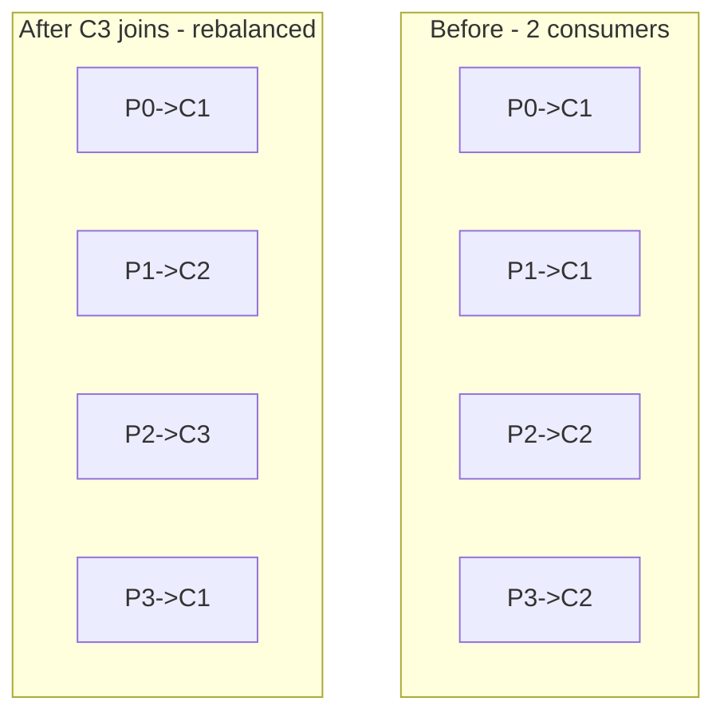

**Why you should care:** during a "stop-the-world" rebalance, consumption **pauses** across the group. Frequent rebalances hurt throughput and latency.

**Improvements to know:**

- **Cooperative (incremental) rebalancing** — only the partitions that need to move are revoked, instead of everyone dropping everything. Much less disruptive; it's the modern default.
- **Static membership** (`group.instance.id`) — lets a briefly-restarting consumer rejoin without triggering a full rebalance.
- Tune `session.timeout.ms` / `heartbeat.interval.ms` / `max.poll.interval.ms` to avoid false "dead consumer" detections (a common cause of surprise rebalances is slow message processing exceeding `max.poll.interval.ms`).

---

## 9. Data Retention, Log Compaction & Storage

Kafka **stores** data — that's a feature, not a side effect. How long and how it's cleaned up is configurable per topic.

### Retention (time / size based)

The default cleanup policy is `delete`: records older than a retention period (e.g. `retention.ms=7 days`) or beyond a size limit (`retention.bytes`) are deleted in whole **segments**.

```
Topic partition split into segments on disk:

 [segment 0 (old)] [segment 1] [segment 2] [active segment]
      ▲ deleted when past retention          ▲ currently written
```

Data is written to **segment files**; only closed (non-active) segments are eligible for deletion. This makes cleanup cheap (delete a file) rather than record-by-record.

### Log compaction

The alternative cleanup policy is `compact`. Instead of deleting by age, Kafka keeps **the latest value for each key** and removes older values for that key.

```
Before compaction (by offset):
  key=A:v1   key=B:v1   key=A:v2   key=C:v1   key=A:v3   key=B:v2

After compaction (latest per key retained):
  key=C:v1   key=A:v3   key=B:v2
```

Use cases: **changelog / current-state topics** — e.g. "latest known address for each customer." A new consumer can rebuild full current state by reading a compacted topic from the beginning. A record with a `null` value is a **tombstone** that signals deletion of that key.

### Tiered storage

Modern Kafka supports offloading older segments to cheaper object storage (e.g. S3) while keeping recent data on local disk — enabling very long or "infinite" retention without huge local disks.

### Why storage-based design is powerful

- **Replay & reprocessing:** rerun a new version of a consumer over historical data.
- **New consumers get history:** a service added later can read from the beginning.
- **Source of truth / event sourcing:** the log itself becomes the authoritative record of what happened.

---

## 10. How Kafka Enables Fault-Tolerant Systems

Fault tolerance is designed in at every layer. Here's how each concept contributes:

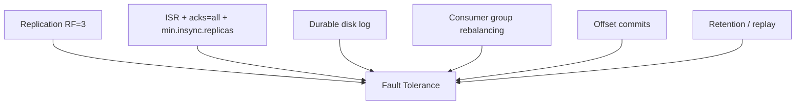

| Failure scenario | How Kafka handles it |
|---|---|
| **A broker crashes** | Followers on other brokers take over as leaders for that broker's partitions. No data lost if `acks=all` + sufficient ISR. |
| **A consumer crashes** | Its partitions are rebalanced to surviving consumers in the group. The new owner reads the group's bookmark from `__consumer_offsets` and continues from there. Nothing is lost; records the dead consumer processed but never committed are re-read, so duplicates are possible. |
| **A producer's network blips** | Idempotent producer retries safely without creating duplicates. |
| **A downstream service is down** | Messages sit durably in Kafka; the consumer catches up when it recovers. Producer is unaffected (temporal decoupling). |
| **Bad deploy corrupts processing** | Fix the code, **reset offsets**, and reprocess from history. A reset is just a commit of offset 0 as a new record to `__consumer_offsets`. Latest wins. |
| **Traffic spike** | Kafka absorbs the burst as a buffer; consumers drain at their own pace (natural backpressure / load leveling). |

### Kafka as a shock absorber (load leveling)

```
Bursty producer traffic          Kafka buffers it          Steady consumer rate
     ▁▂▇█▇▂▁▇█▁  ───────────►   [======= log =======] ───────────►  ▄▄▄▄▄▄▄▄▄▄
   (spikes overwhelm            (durable queue holds       (consumer processes at
    a direct call)               the backlog)               a sustainable pace)
```

This decoupling of **arrival rate** from **processing rate** is one of the biggest reliability wins Kafka gives you.

---

## 11. Kafka in Microservice Architectures

Kafka is a natural backbone for microservices because it enables **asynchronous, event-driven communication**.

### Synchronous (REST) vs Asynchronous (Kafka)

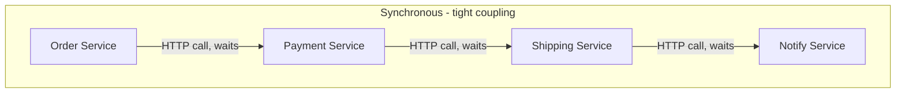

Problems with the synchronous chain: if any service is slow or down, the whole request fails; services must all be up simultaneously; hard to add new steps.

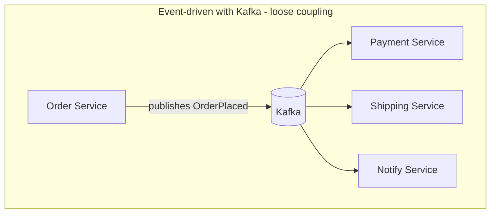

With events: the Order Service just announces "OrderPlaced" and moves on. Each downstream service reacts independently. Adding a new consumer (e.g. Analytics) requires **zero changes** to the Order Service.

### Key patterns Kafka enables in microservices

- **Event-driven architecture (EDA):** services communicate by emitting and reacting to events rather than calling each other directly.
- **Event sourcing:** store state changes as an immutable sequence of events; the current state is derived by replaying them. Kafka's log is a great fit.
- **CQRS (Command Query Responsibility Segregation):** writes emit events; separate read-optimized views are built by consuming those events.
- **Database per service + data sharing:** each service owns its DB; it publishes changes as events so others can build their own local views — no shared database coupling.
- **Change Data Capture (CDC):** tools like Debezium stream database row changes into Kafka, turning your existing DB into an event source.

### The Saga pattern (distributed transactions)

Since you can't have a single ACID transaction across microservices, use a **saga**: a sequence of local transactions coordinated via events, each with a **compensating action** if a later step fails.

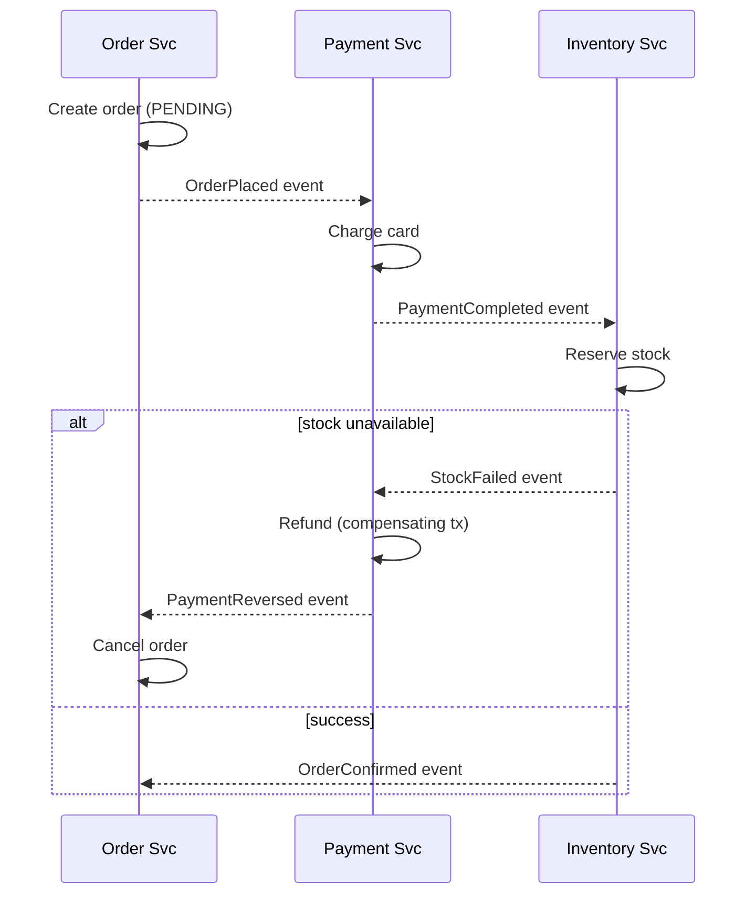

Kafka is commonly the event bus that carries these saga events between services.

---

## 12. Common Design Patterns

| Pattern | What it is | Kafka role |
|---|---|---|
| **Pub/Sub fan-out** | One event, many independent reactions | Multiple consumer groups each read the full stream |
| **Work queue** | Distribute tasks among workers | One consumer group; partitions spread work across consumers |
| **Event sourcing** | State = replay of event log | Kafka is the durable, ordered event store |
| **CQRS** | Separate write and read models | Events feed read-side materialized views |
| **Stream processing** | Transform/aggregate streams in real time | Kafka Streams / Flink consume, process, produce |
| **Log compaction / state topic** | Keep latest value per key | Compacted topic as a distributed key-value snapshot |
| **Dead Letter Topic (DLT)** | Park messages that repeatedly fail | Route poison messages to a separate topic for inspection |
| **Outbox pattern** | Reliably publish events + DB write atomically | Write event to a DB "outbox" table, CDC ships it to Kafka |

### The Dead Letter Topic

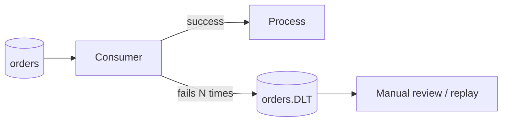

Prevents a single "poison" message from blocking the whole partition forever.

### The Outbox pattern (reliable event publishing)

A subtle but important problem: how do you update your database **and** publish an event without a distributed transaction? If you write to the DB and then the app crashes before publishing to Kafka, the event is lost (dual-write problem).

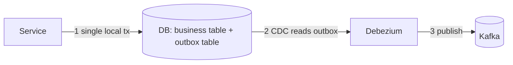

The business change and the outbox row are written in **one local transaction**; a CDC connector reliably ships the outbox rows to Kafka afterward.

---

## 13. The Kafka Ecosystem

Kafka is more than the broker. The surrounding tools are often what make it usable in practice.

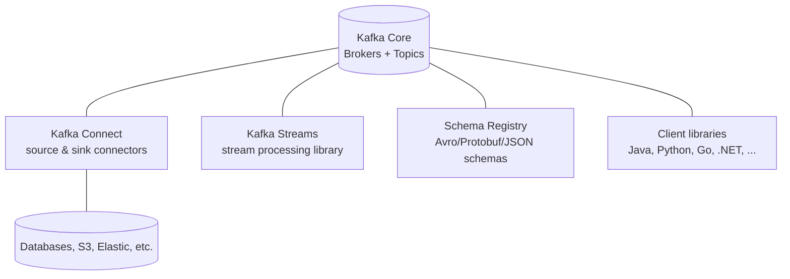

- **Kafka Connect** — a framework of ready-made **connectors** to move data in (source) and out (sink) of Kafka without writing code. E.g. JDBC, Debezium (CDC), S3, Elasticsearch.
- **Kafka Streams** — a Java library for building stream-processing apps (filter, join, aggregate, windowing) directly on top of Kafka, with exactly-once support and local state stores.
- **ksqlDB** — SQL-like interface for stream processing.
- **Schema Registry** — stores and versions message schemas (Avro/Protobuf/JSON Schema) and enforces **compatibility rules** so producers and consumers don't break each other when data formats evolve.
- **Client libraries** — official and community clients for most languages.
- **Managed offerings** — Confluent Cloud, Amazon MSK, Aiven, Redpanda (Kafka-compatible), etc., to avoid running it yourself.

### Why Schema Registry matters

Without a contract, a producer changing its JSON shape can silently break every consumer. Schema Registry enforces **schema evolution** rules (backward/forward compatibility), so you can add fields safely and catch breaking changes at deploy time rather than at 3 a.m.

---

## 14. Operational Concerns & Pain Points

Kafka is powerful but not free. Know these before you build on it.

| Concern | What to watch for |
|---|---|
| **Consumer lag** | The gap between the latest offset and the consumer's committed offset. Rising lag = consumers falling behind. Monitor it as a primary health metric. |
| **Partition count planning** | Too few = limited parallelism; too many = overhead and long rebalances. Hard to reduce later. |
| **Rebalancing storms** | Slow processing or flaky consumers cause repeated rebalances that stall the group. |
| **Hot partitions** | A skewed key distribution overloads one partition/consumer. |
| **Message size** | Kafka is optimized for many small messages, not huge payloads. Store large blobs elsewhere (e.g. S3) and pass a reference. |
| **Duplicate handling** | At-least-once means consumers must be **idempotent** (safe to process the same message twice). |
| **Ordering assumptions** | Remember order is per-partition only. Don't assume global ordering. |
| **Exactly-once cost** | Transactions add complexity and some latency; use only where truly needed. |
| **Operational burden** | Self-managing a cluster (upgrades, balancing, disk, monitoring) is real work — managed services offload much of it. |
| **Schema evolution** | Without a registry and compatibility discipline, data-format changes break consumers. |
| **Poison messages** | One un-processable message can block a partition; use retries + dead letter topics. |

### Consumer lag, visualized

```
Partition 0 latest offset ─────────────────────────► 10,000
Consumer committed offset ───────────► 7,200
                          ◄── LAG = 2,800 messages behind ──►
```

Alert when lag grows unbounded — it means you need more consumers/partitions or your processing is too slow.

---

## 15. When NOT to Use Kafka

Kafka is not a golden hammer. Reconsider if:

- **You need request/response with immediate replies.** Kafka is async and one-way by nature; a synchronous REST/gRPC call is simpler.
- **You have very low volume and simple needs.** A traditional message queue (RabbitMQ, SQS) or even a database table may be far simpler to run.
- **You need complex per-message routing, priorities, or per-message TTL/acknowledgement.** Classic brokers (RabbitMQ) do these more naturally; Kafka's model is streams and offsets, not individual message acknowledgement.
- **You need tiny end-to-end latency in the microseconds.** Kafka is low-latency but batches for throughput.
- **You can't invest in the operational/learning curve** and no managed option fits.

A good rule: choose Kafka when you need **high-throughput, durable, replayable, multi-consumer event streams** — and reach for a simpler tool when you don't.

---

## 16. Glossary of Terms

| Term | Definition |
|---|---|
| **Event / Record / Message** | A single unit of data: key + value + headers + timestamp. |
| **Topic** | A named stream of records; the logical channel. |
| **Partition** | An ordered, append-only log; a topic is split into partitions for scale. |
| **Offset** | A record's position within a partition. |
| **Producer** | Client that writes records to topics. |
| **Consumer** | Client that reads records from topics. |
| **Consumer Group** | A set of cooperating consumers; each partition goes to one member. |
| **Broker** | A single Kafka server. |
| **Cluster** | A set of brokers working together. |
| **Controller** | The broker that coordinates cluster admin tasks. |
| **Replica** | A copy of a partition on another broker. |
| **Leader** | The replica that handles all reads/writes for a partition. |
| **Follower** | A replica that copies the leader. |
| **Replication Factor (RF)** | Number of copies of each partition. |
| **ISR (In-Sync Replicas)** | Replicas fully caught up with the leader. |
| **acks** | Producer setting for how many acks to wait for (0, 1, all). |
| **min.insync.replicas** | Minimum ISR count required to accept a write. |
| **Commit (offset)** | Recording how far a consumer has processed. |
| **`__consumer_offsets`** | Internal **compacted** topic where committed offsets are stored, keyed by (group, topic, partition). |
| **Group Coordinator** | The broker that manages one consumer group's membership, heartbeats, rebalances, and offset commits. |
| **Transaction Coordinator** | The broker component that tracks a transactional producer's state and writes commit/abort markers. |
| **`linger.ms` / `batch.size`** | Producer settings bounding how long / how large a batch grows before it is sent. |
| **`read_committed`** | Consumer isolation level that hides records from open or aborted transactions. |
| **Consumer Lag** | How far behind a consumer is from the latest offset. |
| **Rebalance** | Redistribution of partitions among group members. |
| **Retention** | How long/much data is kept before deletion. |
| **Log Compaction** | Cleanup that keeps only the latest value per key. |
| **Tombstone** | A null-value record marking a key for deletion in compaction. |
| **Segment** | A file on disk that stores a chunk of a partition. |
| **Idempotent Producer** | Producer that avoids duplicate writes on retry. |
| **Transaction / EOS** | Atomic multi-partition writes for exactly-once semantics. |
| **KRaft** | Kafka's built-in metadata consensus (replaces ZooKeeper). |
| **Kafka Connect** | Framework for source/sink connectors. |
| **Kafka Streams** | Library for stream processing on Kafka. |
| **Schema Registry** | Central store enforcing message schemas and compatibility. |
| **DLT / DLQ** | Dead Letter Topic/Queue for messages that repeatedly fail. |

---

## 17. Mental Model Cheat Sheet

Keep these one-liners in your head:

1. **Kafka is a distributed, durable, replayable log** — not just a queue.
2. **Topics are split into partitions; partitions are the unit of parallelism and ordering.**
3. **Order is guaranteed only within a partition** — use keys to control placement.
4. **Offsets are the reader's bookmark** — commit them to resume; rewind them to replay.
5. **A consumer group shares partitions; different groups each get the full stream.**
6. **Replication (leaders/followers + ISR) is why Kafka survives broker failures.**
7. **`acks=all` + `min.insync.replicas` = strong durability.**
8. **At-least-once is the default reality → make consumers idempotent.**
9. **Kafka decouples producers and consumers in space, time, and throughput.**
10. **Retention + replay turn the log into a source of truth for event-driven systems.**

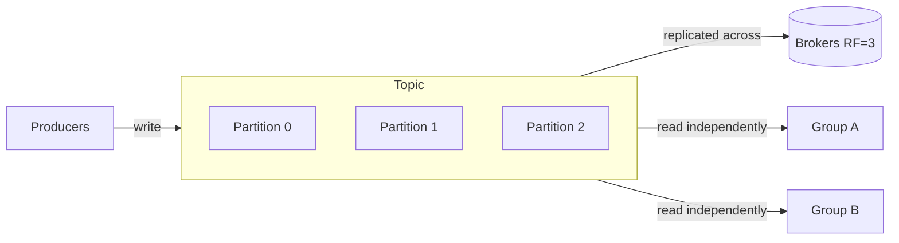

---

### Further learning path

1. Run Kafka locally (Docker or a single-broker KRaft setup) and create a topic.
2. Write a producer and consumer in your language; watch offsets and lag.
3. Add a second consumer to a group and observe rebalancing.
4. Experiment with `acks`, replication factor, and killing a broker.
5. Try log compaction and offset resets to feel replay.
6. Explore Kafka Connect and Kafka Streams for real pipelines.

*Happy streaming!* 🚀
